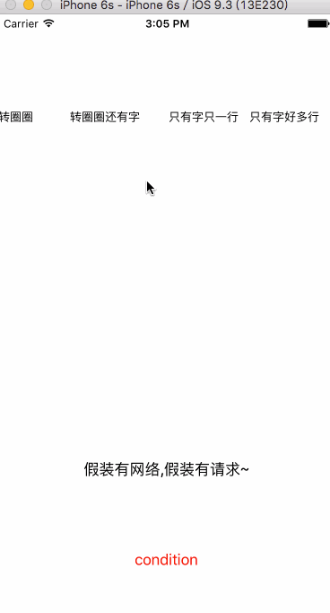
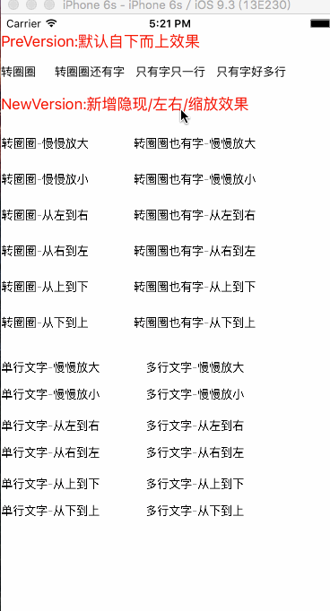
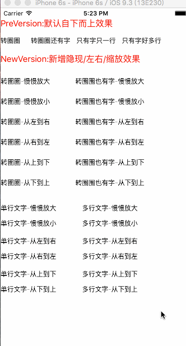

# JHB_HUDView

/****中文类型✅****/
 
/***简介***/ 
这是一款在swift2.2和目标设备8.2及更新的环境最为简单可行的实现并展示进程挡板(HUD)的插件
 
/***Pre实现效果gif(the gif of effect)***/ 
❤️There are 4 types of of pre-SDK can reach out! 
 
  
 
/***New实现效果gif(the gif of effect)***/ 
❤️After days work ,The one had been extented many Show-effect types,And there are main-parts of the effects 
1⃣️TurnCircleType(Just show progress-indicator-view) 
 
 
2⃣️TurnCircleAndMsgType(Show progress-indicator-view with some messages) 
 
3⃣️SingleMsgType(Show no progress-indicator-view with single message) 
 
4⃣️MultiMsgType(Show no progress-indicator-view with multi-lines messages) 
 
 
/****详情****/ 
这是一款用swift语言编写,可用于展示进程信息及进程的,与MBProgressHUD和SVProgressHUD基础功能相似的轻量级插件,可以迅速实现控制器内展示你所需要的挡板效果. 
一,基本: 
<1>开发环境:Xcode7.2 及以上 
<2>目标环境:iOS8.2 及以上 
<3>语言版本:swift2.2 及以上 
 
二,在该应用中,截止目前有以下几类方法可供开发者使用: 
<1>展示进程View:单独展示加载ActivityIndicatorView并展示 
<2>展示进程View及信息:在加载ActivityIndicatorView并展示的前提下,开发者可以自行决定一段需要展示信息,需要注意的是,只可以展示一行 
<3>单纯展示信息(单行):单纯的显示一段开发者需要展示的信息,仅限一行,超出省略 
<4>单纯展示信息(多行):单纯的显示若干句开发者所需要展示的信息,可多行.其宽度已做限制,高度不限~详情可见代码! 
 
三,展示效果: 
当前版本HUD的弹出效果是自下而上并渐现,退出效果为从当前位置自下而上并渐隐 
 
四,PS: 
后期将会添加更多展示效果以供开发者使用,扩充功能并完善维护原版本!请多多关注~感谢您的使用,祝生活愉快! 
 
 
/****The Type Of English✅*****/ 
The Easiest Way To Realize Showing Progress HUD With Swift2.2 And Deployment Target8.2 And Latter  
 
/****Detial****/ 
This is a Lightweight plug-in edited by Swift can show progress-effect and progress-messages,that is similar to MBProgressHUD and SVProgressHUD's basis functions .It can show the HUD-effect that you need in your Controllers rapidly! 
 
First,Basis:
<one>Explore Environment:Xcode7.2 and higher 
<two>Aim Environment:iOS8.2 and higher 
<three>Language Version:Swif2.2 and higher 
 
Second,There are several methods can be used: 
<1>Show the progress-view:Just load and show the ActivityIndicatorView. 
<2>Show the progress-view and messages: Under the premise of the show of ActivityIndicatorView,The you can decide a piece of message that need displayed by yourself ,But limited one-line. 
<3>Just show message(one-line):Just show one-line message that you want to display ,the remainder will be omitted. 
<4>Just show message(multi-line):Just show message that you want to display,ti could be multiple-lines,limited width ,without limited height. 
 
Third,The effect of show: 
At present ,the pop-effect of HUD is from bottom to top and Gradually appear,the quit-effect of HUD is from bottom to top at current-position and Gradually disaappear 
 
Fourth,PS: 
Next,there will be more show-effect to provide to more explorers to use,extent more new function and retain pre-version! Please give more attention~Thanks for your employ, Wish you have a great life! 
 
 
